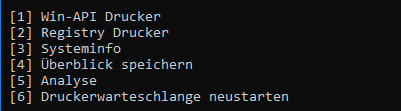

  

<h3 align="center">prinfo</h3>

---

 Fast printer information gathering tool for windows.
     

## Table of Contents

- [About](#about)
- [Getting Started](#getting_started)
- [Usage](#usage)
- [TODO](../TODO.md)
- [Contributing](../CONTRIBUTING.md)

## About 

Gather all relevant informations about the printers in your network in one place with blazing speed. Using the winapi, reading the registry and analyzing printer relevant folders, prinfo displays all the important informations about your printers in seconds.

## Getting Started 

### Installing

Download the latest [release](https://github.com/nikoksr/prinfo/releases) for your system architecture. A single executable, that's all.

**Note**: This is currently a windows only project.

## Usage 

### Main menu
Using prinfo is pretty straight forward. Executing it, you're greated by a simple but classy cli menu.

  

- Option 1 gives a you a quick overview of the printers in your network.
- Option 2 opens a new menu that includes a variety of printer-related functions.
- Option 3 displays the help.

### Functions menu

A list of functions that either gather and display informations or try to analyze and help you identify potential problems.

  

Those are the functions that are executable by the **regular user**.

- Option 1 shows you the relevant informations about your printers that's accesible through the winapi.
- Option 2 shows you relevant informations read from the registry.
- Option 3 shows you informations about the system you're currently using which might also help identifying problems related to printing.
- Option 4 quickly save the most important infos to a text file.

Here begins the **admin area**. It's is hidden from the regular user by default. Functions in this area require the access rights of an admin.

- Option 5 analyzes the printers folder. Check for empty spooler files and incomplete file pairs and show files that shouldn't be in there. A lot of printer problems originate from here. Broken, empty and incomplete spooler files can prevent the spooler from working properly.
- Option 6 quickly restarts the spooler service.

By default every information displaying function includes the option to save the results to a file.
